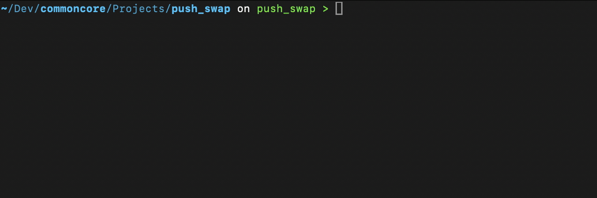

[](https://opensource.org/licenses/MIT)
<br>

<h1 align="center">
  MAKEFILE-ULTIMATE
  <h4 align="center">
  <em>Designed for 42 students, powerful for any C project.</em>
</h4>
</h1>

<p align="center">
  
</p>

# Overview
What started as a simple Makefile for my first structured 42 project (*push_swap*) quickly evolved into much more. While working on the project, I realized that a well-structured build system was essential—not just for compiling code, but for streamlining the entire **development workflow**. I took this opportunity to learn some cool stuff and to create more than just a compilation script.

Indeed, the Makefile-Ultimate is a **C-based sophisticated development tool** which will support you especially during your 42 journey.

Not only this Makefile simplifies project development by handling all the tedious setup and maintenance tasks, but it also helps you finding bugs in your code. From **memory management** to **segmentation faults** and so **much more**. It takes care of your code with detailed debugging information, making debugging easier and more efficient.

The best part? You only need to write few lines, and your Makefile is ready!

<p align="center">
  <br><br>
  
</p>

<br>
<h3 align="center">
    <em>INDEX</em>
    <br><br>
    <a href="#Features">Features</a> <br> ─── <br>
    <a href="#Quickstart">Quickstart</a> <br> ─── <br>
    <a href="#Configuration">Configuration</a> <br> ─── <br>
    <a href="#Usage">Usage</a> <br> ─── <br>
    <a href="#Git Integration">Git Integration</a> <br> ─── <br>
    <a href="#Examples">Examples</a>
  <br>
</h3>


## Features
```
🌈 Colorful output           - Color-coded messages for better readability
🧪 Debug integration         - Built-in support for GDB, AddressSanitizer, and Valgrind
🐳 Docker support            - Cross-platform Valgrind analysis through Docker
🔄 Submodule handling        - Automatic submodule detection and management
🧩 Library management        - Build and link with multiple libraries
📊 Detailed memory analysis  - Track memory leaks and issues with precision
```

# Quickstart

### Prerequisites

- GNU Make
- GCC or Clang
- Git (for submodule features)
- Docker (optional, for cross-platform Valgrind)

### Installation

Copy the Makefile to your root project directory.

If your project requires building an executable:
```bash
wget https://raw.githubusercontent.com/SabaDevvy/ultimate-42-makefile/main/Makefile
```

If your project requires building an archive:
```bash
wget https://raw.githubusercontent.com/SabaDevvy/ultimate-42-makefile/main/Makefile.archive
```

I recommend cloning `.gitignore` file to ignore unnecessary files generated during compilation:

```bash
wget https://raw.githubusercontent.com/SabaDevvy/ultimate-42-makefile/main/.gitignore
```

# Configuration

Input Project name and libraries (separated by space) used within your project

```
# Project
PROJECT          = your_project_name (e.g. push_swap)
# Libraries
LIBS_PRIVATE     := libraries that you made and are not used as submodule. (e.g. libft)
LIBS_SUBMODULE   := libraries added as submodule. (e.g. libft)
LIBS_EXTERNAL    := public libraries. (e.g. minilibx)
```

For the archive Makefile `Makefile.archive`, if you want to test archive functions you have to fill the TEST_FILES variable with your test file/s.
This is very useful, because you'll be able to test your archive function leaks just by creating a test .c file containing main function and calling test functions.

```
TEST_FILES      := test.c test2.c ...
```

## Optimal setup

Organize your root as follows:

```
- Makefile
- src directory:        for source files. You can also make nested direcotry inside of it.
- inlcudes directory:   for .h files.
- libraries directory:  for your library directories. Archive names have to match with directory name
```

*Directories structures for push swap normal and debug compilations:*

<table>
  <tr>
    <th>Before Build</th>
    <th>After Build</th>
    <th>After debug Build</th>
  </tr>
  <tr>
    <td>
      <pre><code>
.
├── includes
├── libraries
│   ├── libft
│   └── libft_io
└── src
│   ├── algorithm
│   ├── initialization
│   └── operations
└── Makefile
      </code></pre>
    </td>
    <td>
      <pre><code>
.
├── includes
├── libraries
│   ├── libft
│   └── libft_io
├── objs
│   ├── algorithm
│   ├── initialization
│   └── operations
├── src
│   ├── algorithm
│   ├── initialization
│   └── operations
├── Makefile
└── push_swap
      </code></pre>
    </td>
    <td>
      <pre><code>
.
├── debug
│   ├── objs
│   │   ├── algorithm
│   │   ├── initialization
│   │   └── operations
│   └── push_swap_debug.exe
├── includes
├── libraries
│   ├── libft
│   └── libft_io
├── src
│   ├── algorithm
│   ├── initialization
│   └── operations
└── Makefile
      </code></pre>
    </td>
  </tr>
</table>

*Directories structures for push swap valgring compilations:*

<table>
  <tr>
    <th>After valgrind Build</th>
    <th>After valgrind docker Build</th>
  </tr>
  <tr>
    <td>
      <pre><code>
.
├── debug
│   ├── objs
│   │   ├── algorithm
│   │   ├── initialization
│   │   └── operations
│   ├── push_swap_debug_val.exe
│   └── valgrind_report.txt        
├── includes
├── libraries
│   ├── libft
│   └── libft_io
├── src
│   ├── algorithm
│   ├── initialization
│   └── operations
└── Makefile
      </code></pre>
    </td>
    <td>
      <pre><code>
.
├── debug
│   ├── docker
│   │   ├── objs
│   │   ├── libft_docker.a
│   │   └── libft_io_docker.a
│   ├── push_swap_debug_val.exe
│   └── valgrind_report.txt
├── includes
├── libraries
│   ├── libft
│   └── libft_io
├── src
│   ├── algorithm
│   ├── initialization
│   └── operations
└── Makefile
      </code></pre>
    </td>
  </tr>
</table>

Notice that *objs/* is created in docker directory because objects are compiled inside docker container and kept separate from root/objs, in order to avoid relinking in docker rule.
These object files (.o) are required because they are *ELF* binary files, essential for compiling in a Linux environment.
Same applies for libft_docker.a and libft_io_docker.a that are libraries archives compiled inside docker contatiner

## Common Errors

If you are running valgrind docker and getting linking errors, you just need to run `make fclean-deep` in order to clean libraries objs/ directories and re run with valgrind.

<p align="center">
  <br><br>
  <video src="docs/videos/docker_objs.mp4" alt="Docker objs fix" width="100" autoplay loop muted playsinline controls></video>
</p>

# Usage

## Commands

```bash
# See all available commands and compile configurations
make help
```

### Basic Commands

```bash
# Compile your project
make

# Clean object files
make clean

# Remove all generated files
make fclean

# Rebuild from scratch
make re

# Remove all libraries generated files
make fclean-deep

# Rebuild from scratch project and libraries
make re-deep
```

### Debug Features

```bash
# Build with debug symbols:    Useful for general debugging (segmentation fault, leaks...) if ASAN is supported
make debug

# Runs debug build
make debug-run

# Run with leak detection
make leak-check

# Debug with GDB
make debug-gdb
```

### Valgrind Analysis

```bash
# Run Valgrind analysis:        run valgrind natevily (make valgrind-native) or in docker container (make valgrind-docker) in case valgrind is not suported
make valgrind

# Linux-native Valgrind
make valgrind-native

# Docker-based Valgrind
make valgrind-docker
```

### Other features
```bash
# Dependencies check:          checks if local environment (libraries and submodules) is ready and if submodules are up-to-date / modified and not committed
make validate_env

# Init and update submodules
make update_submodules

# Clones LIBS_PRIVATE          -> github repo name has to be the same 
make clone_repos
```

## Flags
```
- VERBOSE=1    - removes silent flag which will result in very detailed information printed in the terminal.
- DETAILS=1    - prints compilation files and obj path.
- DEBUG=1      - actives source code in #ifdef DEBUG <...> endif blocks. Useful for debugging inside functions.
- SLEEP=1      - (with docker valgrind) creates persistent container instead of destroying after use.
- ARGS=<"..."> - arguments for make commands that run the exe. For multiple arguments use: ARGS='"..." "..."'
```

# Git Integration

Makefile-Ultimate contains rules to streamline your Git workflow with safe operations that prevent common errors and data loss. These commands handle stashing changes automatically and provide clear, color feedback.

```bash
# Pull latest changes safely (auto-stashes and restores local changes)
make pull

# Update all tracking branches (fetches and pulls all branches)
make pull-all

# Safely checkout a branch with auto-stashing (if selected)
make checkout to=branch-name

# Commit and push changes in one command
make commit m="Your detailed commit message"

# Safely merge branches with auto-stashing (if selected)
make merge from=source-branch

# Check if working directory is clean
make is-clean

# Discard all local changes (with confirmation)
make clean-all

# Discard all local and unpushed commits to match the remote (with confirmation)
make reset-to-remote
```

# Examples


